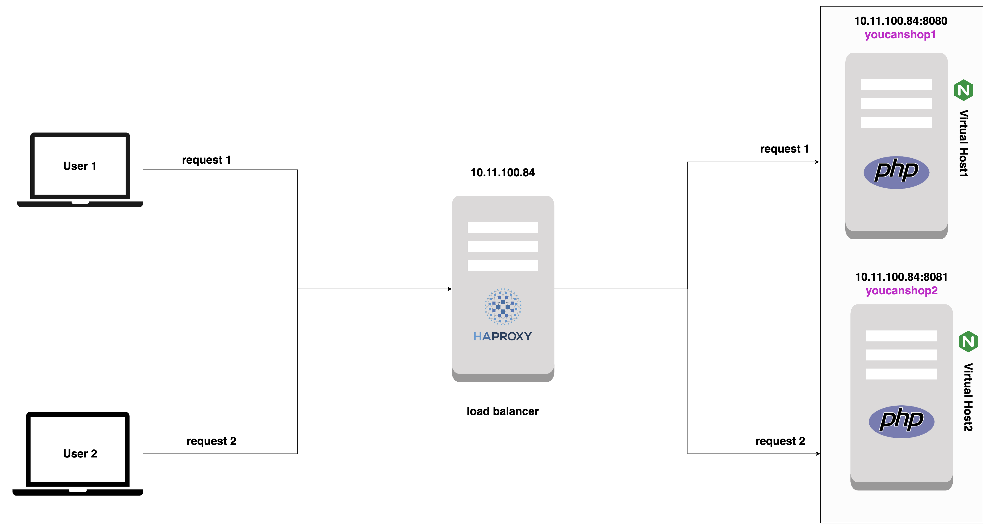

# Coding challenge IV: Save our app from DDos attacks

This project is about configuring the haproxy as a load balancer for two Nginx Virtual Hosts

## Dependencies
The project depends on:

* Ansible:

* Docker/Docker-compose:

and some external dependencies:

* Nginx: 

* haproxy:

* php:

## Building the project

This is a general structure representing the approach we will be taking in order to build the project:

To demonstrate how to configure HAProxy, I have set up a test environment comprising two NGINX instances (Virtual Hosts) hosted on the same server but at different ports with different php web pages. I have installed HAProxy on a Ubuntu server and configured it as a load-balancer meaning it distributes the requests onto these NGINX instances using a round-robin mechanism.
