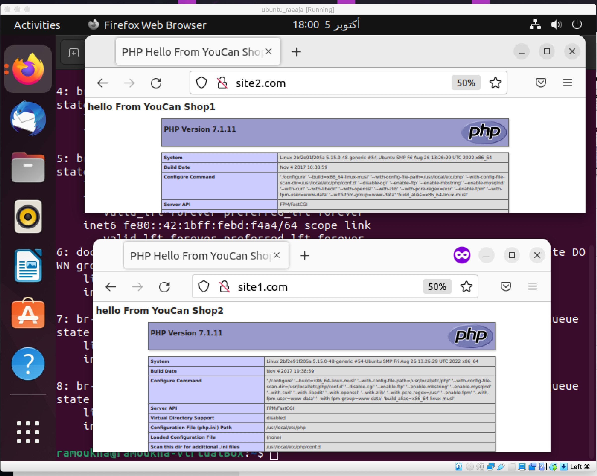

# Coding challenge IV: Save our app from DDos attacks

This project is about configuring the haproxy as a load balancer for two Nginx Virtual Hosts

## Dependencies
The project depends on:

* Ansible: a suite of software tools that enables infrastructure as code.

* Docker/Docker-compose: tool for defining and running multi-container Docker applications.

and some external dependencies:

* Nginx: is a web server that can also be used as a reverse proxy, load balancer, mail proxy and HTTP cache. 

* haproxy: high availability server load-balancer and proxy solution for TCP and HTTP-based applications.

* php: Is a general-purpose scripting language geared toward web development

## Building the project

This is a general structure representing the approach we will be taking in order to build the project:


To demonstrate how to configure HAProxy, I have set up a test environment comprising two NGINX instances (Virtual Hosts) hosted on the same server but at different ports with different php web pages. I have installed HAProxy on a Ubuntu server and configured it as a load-balancer meaning it distributes the requests onto these NGINX instances using a round-robin mechanism.
## Guidelines

To run this project you don't have to check if the dependencies installed in your server; everything is automated. The Ansible playbook will check if the dependencies are installed, they will be automatically installed in which case they were not installed. Assuming you will be running this project on a fresh environment to prevent conflicts.
 

* first run the script install_ansible.sh
```
sudo sh install_ansible.sh
```
the script above displays the Ansible version if it is installed else it installs it.

Before running the Ansible playbook  you need to add these domaine names to the /etc/hosts:

```
www.site1.com www.site2.com site1.com site2.com
```

When this playbook is installed it will run 3 containers based off the structure below:


we execute this playbook using this command:

```
sudo ansible-playbook playbook.yml
```

This command will launch the following roles:

1. Install Docker and its dependencies from official documentation if they are not already installed and add permisions to it

2. Install Docker-compose and its dependencies from official documentation if they are not already installed and add permisions to it

3. Destroy images and containers and existing volumes to prevent port conflict and names (Again, Assuming you are running this in a test environment)

4. Execute the Docker compose to launch the containers Nginx, Haproxy and PHP.

## testing 

### test 1

go the browser and check by  entring

```
<YOUR IP ADRESS>:8080 (to see the content of the site1.com)
```

```
<YOUR IP ADRESS>:8081 (to see the content of the site2.com)
```


### test 2

go the browser and check by  "YOUR IP ADRESS"  and refresh to see diferent websites load 

```
<YOUR IP ADRESS>:80 
```


### test 3

go the browser and check by entring:

```
<YOUR IP ADRESS>:84/stats
```


